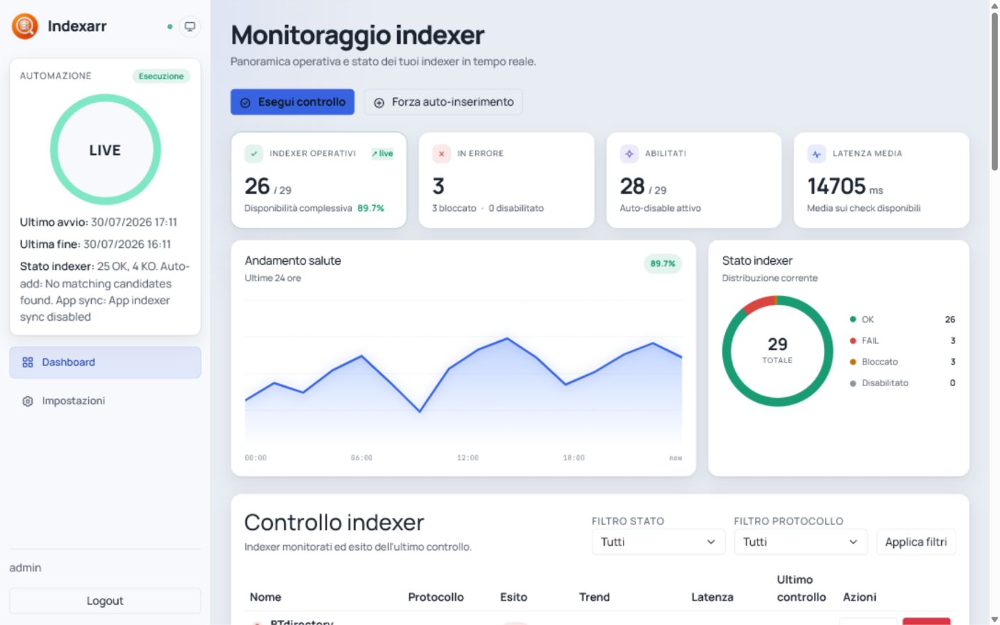
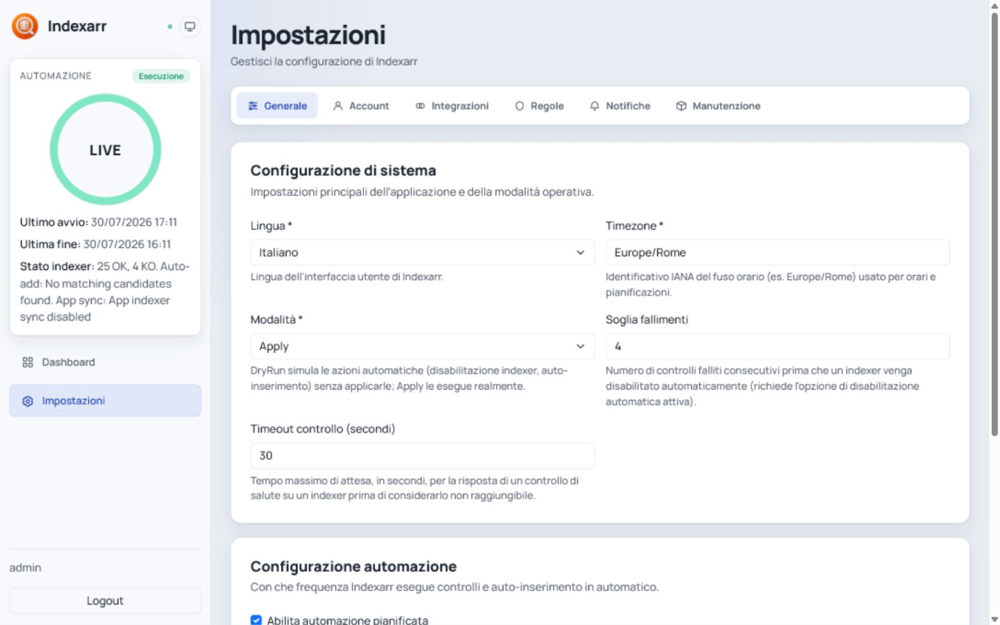

# Indexarr 📡

> [!WARNING]
> **Vibe-coded project.** Indexarr is built through a fast, AI-assisted and experimentation-driven workflow. It is actively evolving: review changes carefully and test them in your own environment before relying on automatic remediation for production Prowlarr instances.

**Indexarr** is a self-hosted control room for Prowlarr indexers. Monitor availability in real time, keep an audit trail, automate health checks and apply safeguards before unhealthy indexers become a problem. Its standout capability is rule-driven discovery and automatic onboarding of new indexers, so your stack can keep improving without constant manual searching.

## ✨ What you can do

| | |
| --- | --- |
| 📊 **See the whole picture** | Follow availability, latency, status distribution and health trends from one live dashboard. |
| 🩺 **Run health checks** | Check indexers on demand or on a schedule, then filter the results by state and protocol. |
| 🛡️ **Protect your stack** | Disable or block unhealthy indexers according to the safeguards you configure. |
| 💾 **Keep recoverable backups** | Preserve Prowlarr exports before changes, with dedicated configuration and backup storage. |
| ➕ **Automate onboarding** | Let Indexarr evaluate candidates for controlled, guided indexer auto-add workflows. |
| ⚙️ **Stay in control** | Choose between `DryRun` and `Apply`, set thresholds and tune automation intervals from the web UI. |

## 📸 See it in action

### Monitor indexer health at a glance



Track operational indexers, failures, latency and recent health trends, then drill into the current state of every configured indexer.

### Configure safe automation



Set the operating mode, failure threshold, timeout and schedule before Indexarr performs automatic actions.

## 🚀 Deploy in minutes

### Unraid (recommended)

Indexarr is available in **Unraid Community Apps**. Search for **Indexarr** in the Apps tab, install it, then configure your Prowlarr URL and API key.

You can also install from the template directly:

```text
https://raw.githubusercontent.com/gabryk91/Indexarr/main/unraid/Indexarr.xml
```

The template configures the web port, persistent storage, timezone and the main Prowlarr/automation variables.

### Docker

```bash
docker run -d \
  --name indexarr \
  --restart unless-stopped \
  -p 9697:8080 \
  -e TZ=Europe/Rome \
  -e Indexarr__Prowlarr__Url=http://prowlarr:9696 \
  -e Indexarr__Prowlarr__ApiKey=YOUR_API_KEY \
  -v /path/to/indexarr/config:/config \
  -v /path/to/indexarr/backups:/backups \
  -v /path/to/indexarr/logs:/logs \
  gabryk83/indexarr:latest
```

Then open `http://localhost:9697`.

> [!TIP]
> Keep `/config` and `/backups` persistent. They contain Indexarr settings, its SQLite database and recoverable Prowlarr exports.

## ⚙️ Configuration essentials

| Variable | Purpose |
| --- | --- |
| `Indexarr__Prowlarr__Url` | Base URL of the Prowlarr instance to manage. |
| `Indexarr__Prowlarr__ApiKey` | Prowlarr API key; keep it secret. |
| `Indexarr__Automation__Enabled` | Enables scheduled health checks and auto-add workflows. |
| `Indexarr__Automation__IntervalMinutes` | Interval between scheduled runs. |
| `Indexarr__ConfigPath` | Persistent configuration and SQLite database path. |
| `Indexarr__BackupPath` | Destination for backup exports. |
| `Indexarr__LogsPath` | Optional persistent log directory. |
| `TZ` | IANA timezone used for UI timestamps and scheduling. |

Useful endpoints:

- `GET /healthz`
- `GET /readyz`
- `GET /api/meta`
- `GET /api/automation-status`

## 🔐 Safety model

Indexarr is designed to make automation explicit. Start with **DryRun** to validate your configuration, preserve backups, then switch to **Apply** only when you are comfortable with the rules and thresholds. Never expose your Prowlarr API key in screenshots, issues or public configuration files.

## 🧪 Project status

Indexarr is under active development. Feedback, bug reports and real-world health-check scenarios are welcome.

- 🐛 [Report an issue](https://github.com/gabryk91/Indexarr/issues)
- 💡 [Browse the source code](https://github.com/gabryk91/Indexarr)
- 🐳 [View the Docker image](https://hub.docker.com/r/gabryk83/indexarr)

## 📄 License

Indexarr is released under the [MIT License](LICENSE).
